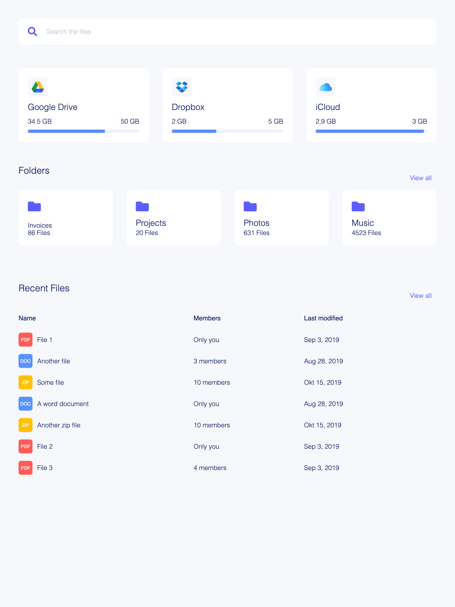

## Building and running on localhost

First install dependencies:

```sh
npm install
```

To run in hot module reloading mode:

```sh
npm start
```

Open your browser at http://localhost:1234

## Assignment

### CSS - Part 1

1. Add a Dropbox and iCloud card next to Google Drive. Use flexbox.

2. Create a section above "Recent Files", named "Folders", with 4 cards. You can use FontAwesome icons:
```html
<i class="fas fa-folder"></i>
```

### CSS - Part 2

3. Clean up the CSS. Use [BEM and SMACSS](./CleanCSS.md).

4. Make CSS more DRY and bundled. Use [SCSS](https://sass-lang.com/guide). Create a main.scss file in src/styles and add a link to HTML head to ./styles/main.css. Start SASS watcher with `yarn sass` or `npm run sass`



## Help

- https://github.com/AakashRao-dev/CSS-Cheatsheets
- https://caniuse.com/
- https://developer.mozilla.org/en-US/docs/Learn/CSS
- https://sass-lang.com/guide

## Tools

- FlexBox tool: https://codepen.io/justd/full/yydezN/
- Shadow palette generator: https://www.joshwcomeau.com/shadow-palette/
- CSS gradient: https://cssgradient.io/